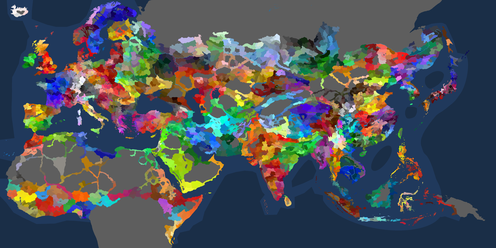
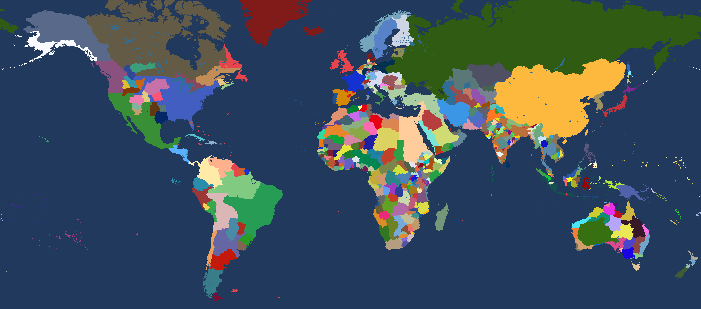

# 地图编辑器（CK3 / EU4 / HOI4 / Victoria 3 / EU5）

> 作者：**永夜廿九**（B 站同名）

一个在浏览器里给游戏地图**涂色、换色、导出**的小工具。想改哪块就点哪块，
改完可以导出成图片，也可以把涂色存成文件下次接着改。

支持 5 个游戏、7 张地图：

- **十字军之王 3**（CK3）
- **欧陆风云 4**（EU4）
- **钢铁雄心 4**（HOI4）—— 原版 + 修改边界
- **维多利亚 3**（Victoria 3）
- **欧陆风云 5**（EU5）—— 原版 + 原尺寸（分块加载）

---

## 一、怎么开始

**这个工具就是一个文件**：`pdx-map-editor.html`（约 35 MB，7 张地图的数据全烘在里面）。
拿到它，**双击**，用浏览器打开（Chrome / Edge / Firefox 都行），第一屏让你**选一张地图**，
点一下就进去。

拿到它的办法（挑一个）：

- **最省事**：去 [Releases](../../releases) 下这一个文件（那里只有它）；
- **在仓库里**：点开根目录的 `pdx-map-editor.html`，右上角「Download raw file」；
  已经把仓库 clone 下来的话，它就在根目录，直接双击。

不需要装任何东西、不需要联网、不需要起服务器。拷到别的电脑（U 盘、网盘）照样能用。

> 只想自己重新烘数据、改代码的，看 [`docs/构建与开发说明.md`](docs/构建与开发说明.md)。

## 二、界面分成三块

- **顶栏**：左边「**视图**」是一排层级按钮（点一下切到那一级），挨着是「**工具**」；
  工具栏右边是「**教程**」和署名；右半边是「设置」「↶ ↷」（撤销 / 重做）、「主菜单」，
  最右那个「**文件 ▾**」收着**导入 / 导出窗口 / 导出整图 / 导出高清地图 / 导出涂色 / 导出日志 / 清除** ✓；
- **左栏**，从上往下：**显示**（各层级的颜色 / 边界 / 名称开关）、
  **当前颜色**（正在用的颜色 + 标记名）、**悬停地块**（鼠标指着哪块地）、
  **查找**（搜索框）、**调色板**（取过的颜色都留着，点一下就能再用）；
- **中间**：地图。按住拖动平移，滚轮缩放。

### 视图与「粒度」

层级按钮就是「视图」：切到哪一级，地图就画那一级的配色和边界。

年份模式（EU4 的 `1444 / 1618 / 1789`、HOI4 的 `1936 / 1939`、V3、EU5）多一个玩法：

- 在年份视图下**再按一下更细的层级**（比如「省份」），那一层就变成「**粒度**」——
  画面仍是那一年的配色，但**边界和涂色按粒度那一层走**，方便你对着年份改省份；
- **再按一次同一层**就取消粒度，回到整年粒度；
- 从细层直接按年份层，会顺手把当前这一层收成粒度。

## 三、六个工具

| 工具 | 快捷键 | 作用 |
|---|---|---|
| 查看 | `Q` | 只看不动，避免误涂 |
| 吸管 | `W` | 取这块地**此刻显示的颜色**（连显示开关都算：关掉「头衔 · 颜色」，吸到的就是画面上那个底色）✓ 搜索里点色点、右键取色、点调色板上的色，**都会进「最近用过」** ✓ |
| **填色** | `F` | 涂上当前颜色，**点一下动一次**（按住拖也不会连成一片，怕手滑就用它）|
| **涂抹** | `E` | 涂上当前颜色，**按住拖能刷出一片** |
| **橡皮** | `R` | 变回原来的颜色 |
| 改名 | `N` | 给头衔 / 色块改名字 |

> **填色和涂抹的范围算法是同一套**，唯一的差别就是"按住拖动要不要沿路连发" ——
> 涂抹要（刷得快），填色不要（一次一个，不会手一抖划过去一整片）✓
>
> **取完色会自动切过来**：在搜索里点那个小色块、右键取色、用吸管、点调色板里的色 ——
> 取完之后工具会切到**涂抹**（设置里可以改成切到**填色**）。
> 你要是**本来就在涂抹或填色上**，那就**不动** —— 正在填色时取个色，不该被踹去涂抹 ✓

涂色的顺序一般是：`W` 吸一个色 → `E` 刷到别处 → 刷错了 `R` 还原，
或者点顶栏的「↶ 撤销」。「清除」是把所有改动一次退回原样。

> **剧本视图下，"边界"那两个开关还决定你一笔动多大范围**（涂抹 / 填色 / 橡皮共用同一套 ✓）：
>
> - 开着「**填色 · 边界**」（或者两个边界开关都没开 —— 那种也按它算）→ 先认**玩家涂色的归属**：
>   点的那块地要是跟别处**同色同标记**，就把那一族一起涂 / 一起还原（可能跨国家）；
> - 它**没涂过** → 落到**剧本归属**：看那一格在那一年属于哪个国家，再取**那个国家里跟它同色同标记**的那些
>   （"归属"就是信息界面上显示的那个"标记 + 颜色" ✓ —— 同一个国家里被涂成别的颜色的"占领区"
>   颜色对不上，**不碰**）；
> - 两个都给不出来（点到海、无主地这类）→ 只动**最低单位那一块**；
> - 只开「**势力 · 边界**」→ 直接按剧本归属走。
>
> 不在剧本视图时简单得多（省份、地区那些层）：**认你点的那一级那一块** ——
> 在省份层点只动那一个省，在地区 / 州那一层点就把这一块里的省一起动（不用一个个点）。
>
> **鼠标悬停的高亮是同一套**：悬停时亮起来的范围，就是你点下去会动的范围 ✓
> （涂过的地亮那一族，没涂过的地亮那一年的整个国家；开着地区 / 省份粒度时亮那一块。）

> **名字是"一个连通域一个"。** 同一个名字涂成好几块互不相连的地方
> （本土 + 海外省 + 一堆小岛），**每一块都会标一个名字** —— 不再只留最大的那块，
> 也不用指定"哪一块才算老家"。小岛上的名字会小一号，够不上门槛就不画。

> **涂色不会自动保存。** 刷新或关掉浏览器，涂的内容就没了——这是故意的，
> 免得你以为存好了。想留着就点「**导出涂色**」存成文件，下次「**导入涂色**」接着改。

## 四、那些开关分别管什么

左栏「显示」里每个层级一排开关：**颜色 / 边界 / 名称**。

| 分组 | 管什么 |
|---|---|
| **头衔** | CK3 用。头衔本身的颜色、头衔之间的边界、地名与国名 |
| **势力** | 那一年各个**国家**的配色 / 边界 |
| **地区** | 行政区划（区域、地区、省份这一类）的配色 / 边界 / 名称 |
| **填色** | 你自己涂出来的东西：颜色、边界、名称。**剧本视图下的国名也从这儿开** |
| **荒地** | 「允许」= 允许给荒地涂色；「自动」= 荒地跟着周围自动上色；「清除荒地填色」= 撤销自动上的色 |

三个小提示：

- 「**父级边界**」（在「地区」那组，CK3 在「头衔」那组）管的是**上面那一级**画不画。
  比如你正在看「省份」，关掉它就只剩省份的边界；
- 「势力 · 边界」和「填色 · 边界」**可以同时开**（以前是二选一，现在两条线各管各的）；
- **国名只有一个开关**：「填色 · 名称」（原来「势力 · 名称」画的是同一批点，已经并掉了）。
  想看那年各国的名字就开它，关掉就只剩你涂出来的那些色块名；
- 画面太花就把暂时不看的「颜色 / 边界 / 名称」逐个关掉，只留关心的那一级。

## 五、边界为什么有粗有细

同一张图上边界按级别叠好几层，颜色都一样（深蓝黑），靠**粗细**和**浓度**分层。
四档浓度都在「设置」里能调（见下一节）：

| 这一层 | 什么时候用 | 默认浓度 |
|---|---|---|
| **本层**（你现在看的那一级） | 没开「父级边界」→ 默认档 | 75% |
| **本层** | 开了「父级边界」→ 省份档 | 50% |
| **势力边界**（年份层 / 国家那一圈） | 只要它是"你现在编辑的那一层"→ **势力档** | 100% |
| **父级**（上面那一级） | 开了「父级边界」才画 → 地区档 | 75% |
| **填色线**（你自己涂出来的边界） | 开了「填色 · 边界」就画，最粗、实心 → 势力档 | 100% |

也就是说：**没开父级边界时**图上只有本层一条线，不用压淡；
**开了**就压到 50%，好让上面那条 75% 的实线分得清层次。
**「势力 · 边界」不看这个规矩** —— 它是国家/年份那一层，一律按**「势力边界浓度」**
（设置页那一档，默认 100%、实心）画，不管它这会儿是"本层"还是链上的父辈，浓淡都一样 ✓
**「填色 · 边界」那条线也跟这一档走** ✓（所以那一档调淡，你说的"涂出来的边界"也跟着淡 ✓）
（开着粒度时"本层"是粒度那一层，不算势力边界，仍旧走上面那套省份/默认档 ✓）。
「填色 · 边界」画的是**当前显示颜色**的分界（国家那一层连原版配色也算边界）；
在细层里它只圈**你自己涂出来的那一圈**，不会把原版省界一起加粗。

## 六、设置

> **设置和「最近用过的颜色」是存下来的** ✓ —— 刷新页面、回主菜单再进来，都还在 ✓
> 而且**每张图各存各的**（CK3 的和 EU4 的不会互相串）✓ 想回出厂状态就点「恢复默认」✓
> 侧栏「最近使用」右上角有个「**清空**」，不想留着那些记忆颜色就点它 ✓
> 这跟**涂色**那份存档是两回事：涂色是"回主菜单才存、**刷新就清**"的 ✓

顶栏「**设置**」里有四组：

- **颜色**：空白地区、不可通行区域、不可通行海域、海洋、湖泊、河流各用什么色；
- **边界**：命名是「**某某边界** + 宽度 / 浓度」。**地方边界宽度**（滑条 1~3，步长 0.5；默认 **1** —— 它管的是省份 / 地区那些**地方**线，整套粗细阶梯都拿它当倍率）、**势力边界宽度**（滑条 1~3，步长 0.5；默认 1.5 —— 这个是**粗细本身**，直接决定势力那条线和填色线多粗，不再是"乘在别人身上的倍率"）、**水域边界宽度**和**荒地边界宽度**（同样 1~3，步长 0.5；默认都是 1.5）；浓度五条：**省份 / 地区 / 势力 / 水域 / 荒地边界浓度**（都是滑条 25% ~ 100%，步长 25%，默认全开满）（水域和荒地这两条背景线没有单独的显示开关 —— 它们跟着"边界全关"一起藏）；
- **名字等**：字号倍率；**名字上限**（见上面第三节：一个连通域一个名字之后全图能有几千坨，
  这里按**面积从大到小**只留前 N 个，N 就是 **1~20**，默认 20 ——
  几千个名字每帧都要过一遍，得封个顶 ✗；但别压太狠 —— 画面上真正能看见几个由**字号门槛**决定，这个上限只是兜底 ✓）；**滑杆最右那一格（21）就是「无上限」**，
  旁边会写出来 ✓（那会慢，所以默认停在 12）；
  **取色后切到**（涂抹 / 填色）；底下有「恢复默认」。
- **导出图例**：勾上「画进导出的图」，「导出窗口 / 导出整图」就会在图角加一段**图例 + 标题** ✓
  条目**自动来自你涂出来的颜色**（同色算一组 ✓）；名字就是地图上**现在的显示名**（要改就用「改名」工具 ✓），不要的可以关掉，位置四个角随便放 ✓
  一点没涂的时候，图例先按当前年份的国家列着（做「1789 年的欧洲」这种纯原版配色的图也够用 ✓）

## 七、搜索

搜出来的每一条左边都有个**色点**，显示的就是**这块地此刻的颜色** —— 你涂过它就跟着变（国家行也一样：按名字去手绘层里对，涂过就用你涂的那个色）✓ 点色点只取色、不跳镜头；点整行才跳。

左栏搜索框支持三种输入，都能搜到：**国家代码**（`CHI`、`FRA` 这种三个字母）、
**国家名称**、**省份 / 地区名称**。

- 结果行前面有个小色块，点**色块**只把颜色取到画笔上；
- 点**地区 / 省份**那一行，镜头会飞过去并高亮；
- 点**国家**那一行**不会动镜头**（免得你正看某处被硬拉走）；
- 键盘：**回车**跳到第一条能定位的结果，**Esc** 清空搜索框。

## 八、导出

顶栏「导出 ▾」有五项：

- **导出窗口**：只存下你现在这一屏；
- **导出整图**：整张地图导成 PNG；
- **导出高清地图**：同一个整图，但输出宽高**都翻倍** ——
  **边界是按新的尺度重新画的**（不是把小图放大 ✗），所以细边界不会互相咬掉 ✓
  想印出来、或者在手机上放大看细节，用这份 ✓ 代价是文件大约四倍、导出慢一些 ✓
- **导出涂色**：把涂色（含改过的名字、图例的设定）存成 JSON 文件；
- **导入涂色**：读回那份 JSON 接着改；
- **导出日志**：把这一趟的记录（出过的错、你刚点了什么、当时在看哪张图的哪一层）
  存成一个 txt。**平时用不着** —— 出毛病了、或者想许愿新功能的时候，
  把这个文件发到 B 站评论区，比"它坏了"三个字管用得多 ✓

## 九、常见问题（FAQ）

**Q：我应该在哪里下载？**
A：在 GitHub 或 UP 主粉丝群下载。

**Q：需要付费吗？**
A：不需要。

**Q：需要登录吗？**
A：不需要。

**Q：我应该如何打开它？**
A：用浏览器打开即可。

**Q：我应该如何查看地图图片？**
A：导出整图或窗口即可，格式为 `.png`。

**Q：可以导出为游戏模组吗？**
A：暂时不行。

**Q：里面有 CK3 / EU4 / EU5 / VIC3 / HOI4 的地图吗？**
A：是的，编辑器收录了相应的地图。

**Q：里面有 CK2 / EU3 / VIC2 的地图吗？**
A：并没有收录。

**Q：我是 TNO / KR / PB / …… 玩家，为什么没有相应的地图？**
A：暂时没有收录。如果您迫不及待了，也可以前往 GitHub 下载开发工具并交给 DeepSeek，
命令她帮你加入。

**Q：我应该如何找到想要的 tag 颜色？**
A：在颜色界面搜索即可。

**Q：你说得对，但为什么我不用 MapChart？**
A：您大可以继续使用 MapChart，不过 `pdx-map-editor` 采用的位图绘制方式能让加载更加流畅，
特别是对于 VIC3 和 EU5 等作品。

**Q：如何绘制一个与宗主国相同颜色的附属国？**
A：在绘制版图完成后，吸取宗主国的颜色，并更改标签为附属国，
视图不开启任何地区 / 省份等模式，点击附属国版图一键涂色即可。

下面这些是**用起来之后**容易碰上的：

**涂了半天，刷新一下全没了？**
是故意的，见第三节。想留住请用「导出涂色」。

**荒地（沙漠、不可通行的山地之类）怎么改颜色？**
先在「荒地」这组打开「允许」，然后就能像普通地块一样涂。打开「自动」的话，
它会按周围地块的颜色自动上色——只有某一种颜色占它周边**过半**时才上，
否则保持荒地灰；上错了点「清除荒地填色」。

**地图上的名字太多太挤？**
把暂时不看的层级的「名称」「颜色」关掉，只留你要看的那一级。

**第一次打开 EU5 或 V3 有点慢？**
这两张图地块特别多（四万个上下），开头几秒在读数据，之后就流畅了。

**为什么有些国家名显示成 `CHI` 这样的字母？**
游戏的中文翻译里没有这个国家的译名，工具只好退回显示国家代码。

**搜索框上弹出一个白色下拉（"保存的信息"）？**
那是**浏览器的自动填充**，不是这个工具画的。搜索框上已经写了
`autocomplete="off"`，新版本不会再弹；浏览器里以前存的记录可以在
「设置 → 自动填充和密码」里清掉。

**白屏了 / 底下跳出一块红字？**
那就是出错了（红字里是出错的位置，看着吓人，但**刷新一下通常就好了**）。
想彻底弄明白就把现场发过来：红字那块上直接有「**导出日志（发给作者）**」，
顶栏「**导出 ▾ → 导出日志**」是同一个东西 —— 导出的 txt 里有出错信息、
你刚点过什么、当时看的是哪张图，附在评论里就行 ✓

## 十、关于文件与数据

这个工具**不包含任何游戏原文件** —— 没有游戏脚本、没有本地化文件、
没有美术素材、没有地图贴图。它内嵌的只是**自己解析出来的缓存**：
每个头衔节点的名字 / 代码 / 颜色 / 坐标，加上几张二进制表（像素→省份号、
省份→归属、邻接关系、质心）。地图上的颜色和名字，都是**当场画**出来的。

想换地图、换游戏版本，或者自己重新烘一份数据，看
[`docs/构建与开发说明.md`](docs/构建与开发说明.md)（需要你本机装了对应游戏）。

中文地名的来源：CK3 用游戏自带的简体中文；EU4 用汉化模组（`extract_eu4_zh.py`
会在 workshop 目录里找，找不到就退回英文名）。谢谢汉化组。

## 十一、许可

作者：**永夜廿九**（B 站同名）。代码以 **MIT** 许可发布，见 [`LICENSE`](LICENSE)。
用着有问题、想许愿新功能，欢迎开 issue 或者在 B 站评论区喊我。

游戏的地图数据版权归 Paradox Interactive 所有；本项目只是解析你自己安装的
游戏、把它们画出来，不附带任何游戏文件。
